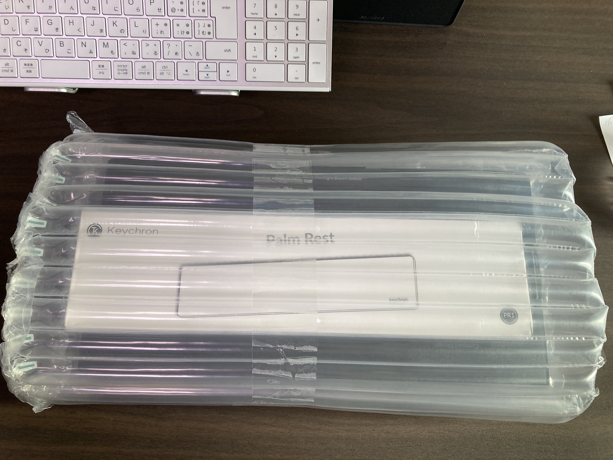
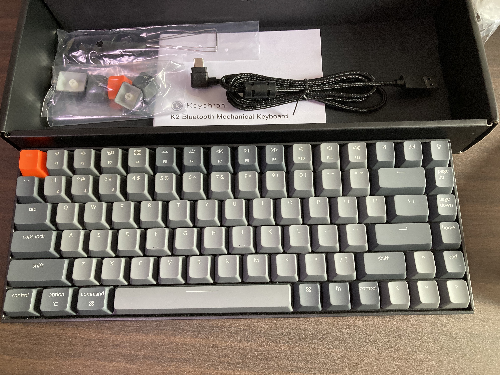
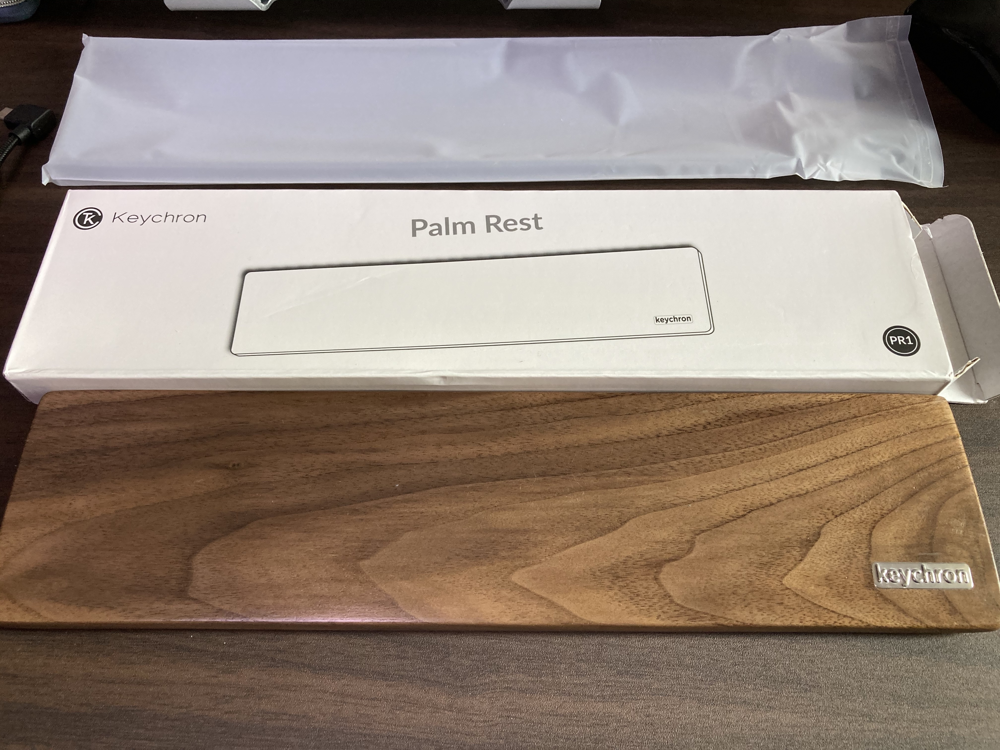

## **keychron k2 レビュー（１ヶ月使用した感想）**

`この記事は、あくまで個人のレビュー見解なので、参考程度にご覧ください！！`

パンタグラフ式キーボードも良いけど、なんか程よい打鍵感がある、新しいキーボードが欲しいなーと思っていました。

HHKBは高すぎるし、そんな安すぎるキーボードもちょっとな。。。と考えていたところに、このキーボードを知りましたので、考えた上で購入しました！！

ということで、KeyChron K2　White&Black 茶軸（メカニカルキーボード）を購入しましたので、１ヶ月使ってみた感じを書きたいと思います！

### 特徴

---
・キー配置は、USキーボード

・3デバイス間で接続可能

・windows,Mac対応

・ブルートゥース、有線接続対応

・テンキーレス

主な特徴は、こんなところでしょうか。

日本において、大きいところでいうと、「 *USキーボード配置*」であることですね！

普段がJIS配列を使用しているなら、購入を検討する方は、頭に置いといてくださいね！！

### 購入方法

---

Amazonなどの通販サイトを利用するのも良いと思いますが、公式から購入するよりも値段が高くなるので、

英語サイトには、なりますが公式サイトからの購入をオススメします！

[KeyChron公式（１０％Offクーポン）](https://www.keychron.com/a/refer-a-friend/redeem/shujitakeda/4893 "https://www.keychron.com/")

なお、購入の際は、**PayPalの登録**または**クレジットカード**が必要になります！

英語表記には、なりますが基本的にGoogle翻訳さんに、協力してもらえば全然問題なく購入出来ると思いますよ！

※住所情報を入力する際は、日本語入力した住所を英語変換してくれるサイトがあるので、無用なトラブルを避ける為にも、そういうのを利用して下さいね！

### 値段

---

私が購入したのは、Keychron K2 Wireless Mechanical Keyboard (Version 2)　White&Black　Brownです。

パームレストも同時購入したので、Totalとしては

`keyboard $62.1($69.0の10%offです) + palm rest $22.5 = $84.6`なので１万円行かないくらいですね！

海外からの発送になるので、送料が別で`$20.0`かかるので、日本円で総額１万２千くらいだと思います！

### 購入後の流れ

---

購入後は、DHLという運搬会社さん経由で、郵送されます。

購入後、発送準備が整った段階で送信されてくるメールに記載されているTrackリンクから状況が終えますので、安心してください！

大体、購入から１週間ほどで到着しましたよ！

普段Amazonで１〜２日で到着するのが日常になっているので、問い合わせようか不安になりましたが、最低１週間は気長に待ちましょう！

外箱に傷とかも見られますが、しっかりと梱包されていたので、凄い嬉しかったですね。問題なく使えそう！！

付属品は、

- MacとWindowsのキー表記切り替えようのキーキャップ

- キーキャップを取外ための器具

- 有線接続ケーブル

### 1ヶ月使用してみた感じ

打鍵時の程よいスコスコ感、全体がコンパクトなので指がホームポジションから、ほとんど離れずにタイピング出来るようになったので、控えめに言って、本当に買ってよかったです！

初めてのUS配列ってところで、慣れるのに少し時間がかかりましたが、この打鍵感と、暗闇で光る感じが、新しいオモチャを買った感じで全然苦にならず、最近、そういえば慣れてきて、JIS配列よりかなり使いやすいと思うようになっていました！

プログラミングをするので、バッククオート、バックスラッシュ、セミコロンなどの記号がJIS配列より遥かに押しやすことに直ぐ気付きました！！（生産性上がった気がするｗ）

ソコソコ厚いキーボードなので、パームレストは持っていない方は、ケチらずに購入した方が良いかもしれませんね！

筆者自体は、普段はスタンディングデスクでの作業なので、パームレストが無くても、そこまで気になりませんが、座って作業をする時は、パームレストが無いと腕シンドってなりました。。。。

打鍵音も、小さくはないので、プログラム書いてる最中に話しかけられたくない方は、「カタカタカタ...」が「話しかけるな」合図に使えるかもしれませんねｗ

### *総評*

---

- 打鍵感：最高
- コスパ：この価格帯であれば、全然大満足
- 見た目：コンパクトで、シンプルでデザインも最高
そんなにお金は費やせないけど、新しいメカニカルキーボードを探している方は、一度ご検討されてみてはいかがでしょうか！

※最後に2点注意事項ですが、

- 「K2」に関しては**技適マークがありません**のでご注意ください！日本で無線で使用したいって方には、注意が必要です。

最近、技適マークのある**KeyChorn K1**が発売されているみたいなので、こちらを検討してみても良いかもしれませんね。

- USキーボード配列なので、JISキーボードとの違いを認識した上で、ご購入をご検討して見てください。

!!ご一読、有難うございました!!
